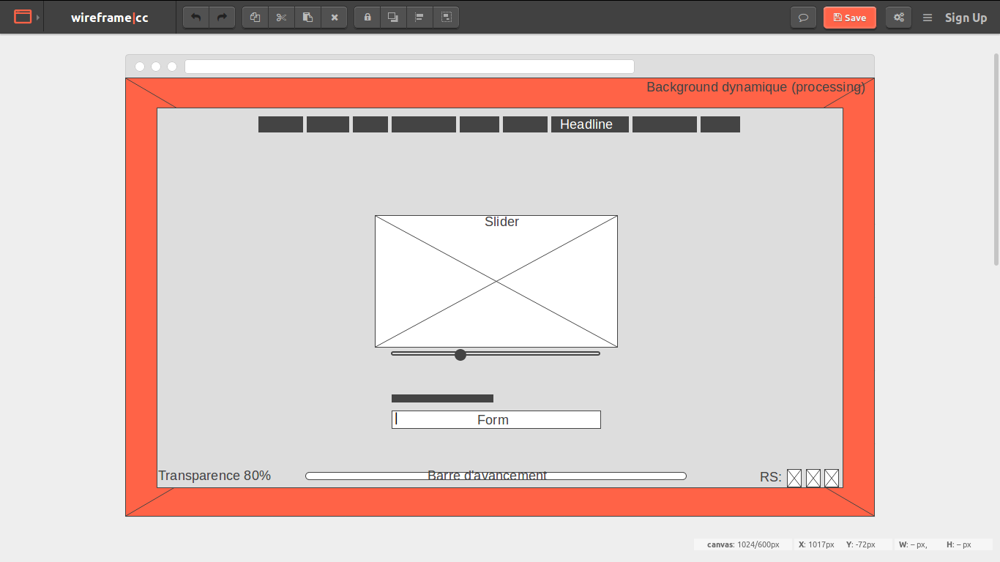

# Anna Cathelineau 

## Qui suis-je ?

Je m'appelle Anna Cathelineau.
Je suis passionnée par le **numérique** et son utilisation dans l'**art**.
Je suis très *enthousiaste* et *travailleuse* mais aussi un peu trop *utopiste*.

## Mon parcours

J'ai d'abord acquis une **expertise dans le domaine de l'art** et de la **gestion de projets culturels** j'ai notamment réalisé un service civique entant qu'assistante expositions et communication à la Fondation HCB.
C'est en découvrant l'utilisation du numérique dans des dispositifs artistiques et à des fins de médiation que je me suis dirigée vers la formations en développement web de Simplon.

## Aujourd'hui

Je suis actuellement en formation chez Simplon car je souhaite pouvoir développer des *sites web* et des *applications* par moi-même.
Je veux developper des compétences en developpement **Fullstack** en me concentrant particulièrement sur le **Backend** en **PHP**.

## Demain

Mon projet professionnel, c'est de **réaliser des projets numériques** de valorisation et médiation pour des **institutions culturelles** publiques ou privées.

Pour me contacter rendez-vous [ici](burger.html) 
Ou juste en dessous ↓↓ 

<section>

   <form action="https://formspree.io/anna.cathelineau@gmail.com"
      method="POST">
    

      

        
Pour me recruter, 
        remplissez ce formulaire !
        

      

      

        Mail:
        <input type="text" name="mail">
      

      

      

      

        Nom:
        <input type="text" name="nom">
      

      

        Prénom:
        <input type="text" name="prenom">
      

      

      

        <input type="radio" name="gender" value="Femme" checked> 
          <label for="femme">Femme</label>
        

      

        <input type="radio" name="gender" value="Homme" checked> 
          <label for="homme">Homme</label>
      

      

        <input type="radio" name="gender" value="Autre" checked> 
          <label for="autre">Indéfini</label>
      

      

      

        <textarea name="message" rows="10" cols="30">
          Votre message.
        </textarea> 
      

      

        <input type="submit" value="Submit">
        
Merci et à bientôt !

      

      

      

        

    </form>

</section>

 [Maquette de la prochaine version](https://wireframe.cc/xx1nDJ), sortie prévue fin octobre 2017.

  

